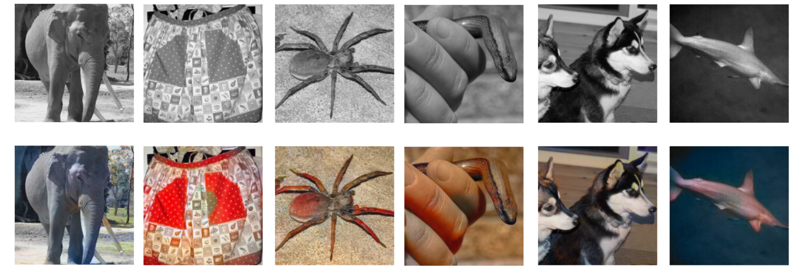

# Photo-Colorization-Pix2Pix-from-scratch-in-PyTorch
PyTorch implementation of the Pix2Pix model from scratch, in-depth notebook

<a href="https://colab.research.google.com/github/matikosowy/Photo-Colorization-Pix2Pix-from-scratch-in-PyTorch/blob/main/notebook-colab.ipynb"></a>
<a href="https://www.kaggle.com/code/mateuszgolebiewski/photo-colorization-with-pix2pix-in-pytorch?scriptVersionId=198284799"></a>

<h2>Introduction</h2>
Welcome to my first-ever in-depth ML project! In this notebook, I will be implementing a Pix2Pix-inspired image colorization model using PyTorch. The goal is to colorize 256x256 grayscale images by training a Generative Adversarial Network (GAN). In my opinion it is one of the most interesting applications of generative deep learning, as not so long ago it was considered impossible to achieve good results in this field without human intervention. I believe that many people may find this project useful, as it is a great introduction to CNNs, GANs, and image processing in general. The code is well-documented and the training process is not very hardware demanding, so it should be relatively quick to train (a few hours) on a modern GPU (depending on the size of your dataset and desired accuracy). I hope you will enjoy this project as much as I did!

By the end of this notebook, the model will be able to colorize images like this:



<h2>Approach</h2>
When loading image files they will usually be in an RGB format (3-channels, one for each: Red, Green, Blue). In such case, the model would have to predict 1 of 255^3 = ~16,5 million values for each pixel in the image. To make it easier for the model to learn, it is a common approach to convert the image to L\*a\*b\* color space first. This format consists of 3 channels: L (lightness), a (green to red), and b (blue to yellow). The L channel is the grayscale version of the image represented as pixel values in [0, 100] range, while the a and b channels contain the color information. Both are represented as arrays of values in [-128, 127] range on Green-Red and Blue-Yellow axes. Now, the model has to choose only 1 of 255^2 = ~65,000 values since the L channel is the grayscale input scaled to [0,100]. This conversion is crucial to achieving state-of-the-art results. It will not only simplify the training process for the model in terms of color choice but also preserve the original shapes of the input image, so the model won't have to reconstruct them from scratch.

<h2>Model</h2>
To achieve the goal I will use a Pix2Pix architecture, first presented in 2016 in the <a href='https://arxiv.org/abs/1611.07004'>Image-to-Image Translation with Conditional Adversarial Networks paper</a>, which I was inspired by when building this project. I've implemented the base solution from the paper and then refined it by doing research. Things that differ from the original paper are: Instance Normalization instead of Batch Normalization, Least-Squares GAN Loss instead of regular Binary Cross-entropy GAN Loss. Both I found being advised by the authors of the paper on <a href='https://github.com/junyanz/pytorch-CycleGAN-and-pix2pix'>GitHub</a>.

<h3>For the rest of the analysis head to <a href='Pix2PixColor.ipynb'>the notebook file.</a></h3>

<h2>Gradio model's deploy</h2>
https://huggingface.co/spaces/matikosowy/Photo_Colorizer

<h2>Pix2Pix original paper</h2>
<a href='https://arxiv.org/abs/1611.07004'>Image-to-Image Translation with Conditional Adversarial Networks - Phillip Isola, Jun-Yan Zhu, Tinghui Zhou, Alexei A. Efros</a>
<p>We investigate conditional adversarial networks as a general-purpose solution to image-to-image translation problems. These networks not only learn the mapping from input image to output image, but also learn a loss function to train this mapping. This makes it possible to apply the same generic approach to problems that traditionally would require very different loss formulations. We demonstrate that this approach is effective at synthesizing photos from label maps, reconstructing objects from edge maps, and colorizing images, among other tasks. Indeed, since the release of the pix2pix software associated with this paper, a large number of internet users (many of them artists) have posted their own experiments with our system, further demonstrating its wide applicability and ease of adoption without the need for parameter tweaking. As a community, we no longer hand-engineer our mapping functions, and this work suggests we can achieve reasonable results without hand-engineering our loss functions either.</p>

```
@misc{isola2018imagetoimagetranslationconditionaladversarial,
      title={Image-to-Image Translation with Conditional Adversarial Networks}, 
      author={Phillip Isola and Jun-Yan Zhu and Tinghui Zhou and Alexei A. Efros},
      year={2018},
      eprint={1611.07004},
      archivePrefix={arXiv},
      primaryClass={cs.CV},
      url={https://arxiv.org/abs/1611.07004}, 
}
```
